## 最初に
この記事はデータベースの内部について、ある程度詳しく知りたいという方に向けています。
できるだけ、簡単に理解できるように書いています。

データはデータベース上で、本当はどのように保存されているのでしょうか？
今回はその中でも、多くのデータベース(MySQL, PostgreSQLなど)が採用しているデータ構造である、B+Treeについて解説します！

## B+Treeとは
B+Treeは一言でいうと、データを効率よく保存でき、素早く検索できる、いろいろな意味でバランスの取れたデータ構造です！
どんなものなのか理解するために、まずはイメージ図を見てください(厳密には違いますが、イメージを共有します)

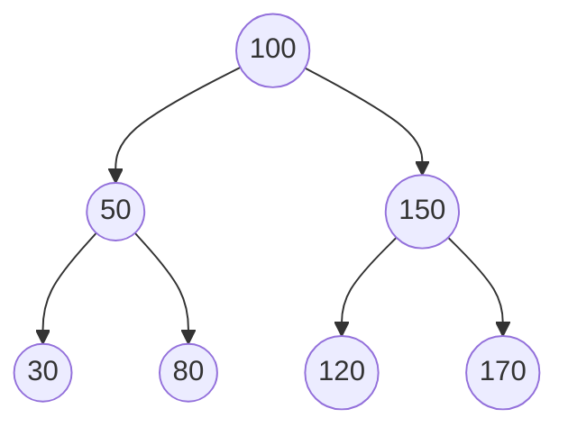

こういった木構造で保存されています。

## なぜ木構造にたどり着いたのか
B+Treeを具体的に解説していくよりも、B+Treeにたどりつく経緯を追って、B+Treeを理解していきましょう！

### 適当に並べてみる
まずは、B+Treeのことはいったん忘れて、何も考えずにデータを保存する
方法から考えてみましょう！
まず最初にシンプルに横並びのものを考えてみます。

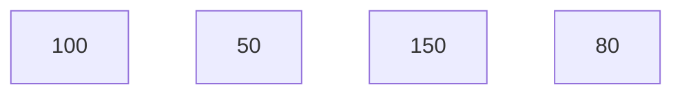

例えば末尾に90を追加しましょう。(INSERT)

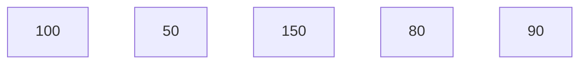
何も考えずに末尾に追加するだけなので、とても楽です！

しかし、150を検索することを考えてみましょう！(SELECT)
どうやって探しますか？
何の規則性もないまま保存しましたから、しらみつぶしに探すしかありませんよね？
最初は100、次が50、次は150
見つけた！150あった！

今回は3回探せばいいだけでしたが、大規模なシステムだとどうでしょうか？
100万以上、場合によっては1億、10億個のデータがあるかもしれませんよね？
しらみつぶしに探すのが全く効率的でないことは一目瞭然ですよね。

### 昇順に並べてみる
効率的にするにはどうすればいいのでしょうか？
次は並べ方に規則性を持たせましょう！
昇順に並べてみましょう！
先ほどの例の場合、こんな感じになります。

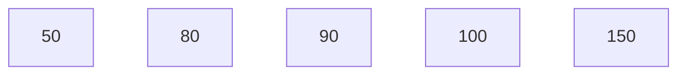

これの何がいいのか。例えば、100を探すとき、しらみつぶしではなく、二分探索というアルゴリズムを用いて、検索することができます。
二分探索とは順序づけられているデータ構造(今回の昇順に並べられたデータ)の探索にとても相性がいいのです。
一番真ん中の値と探している値の大小を比べて、半分に絞ります。そのあと、残った範囲の真ん中の値とまた比較して、さらに半分に絞ります。これを、探している値が見つかるまで続けるだけです。文章だけじゃわかりにくいですよね。

例えば、100を探しましょう。今回はしらみつぶしに探す必要はありません。なぜなら我々は二分探索を使えばいいのです。
一番真ん中の90と100を比べます。
昇順に並べられているデータであり、90 < 100なので、探している100は90よりも右にありますね。
なので、90より右側だけに絞れますよね？右側の半分の値を探しましょう。
今回は2つですが、例えば150が半分の値として計算されたとします。
100 < 150となるので、探している100は150よりも左側にありますよね？
じゃあ90よりも右側にあり、150よりも左側にあるデータは？100しかないです。

これまでに計算した回数は2回だけです。
二分探索というアルゴリズムは最悪でもlog2(n)回の計算で探してるものが見つかるとなっています(nはデータ数)。
この理由は調べてみてください！

例えば、データが1億個あればどうなりますか？
以前のしらみつぶしの探索では、最悪1億回計算して探さなければいけません。
しかし、二分探索はどうなるでしょう？
log2(1億) ≒ 27回
最悪でも27回の探索ですむんです！めちゃくちゃ効率よくなりましたね！

### 昇順のデータに追加してみる
しかしまだ課題があります。データを追加するときです。
先ほどと同様に、90を追加してみましょう！

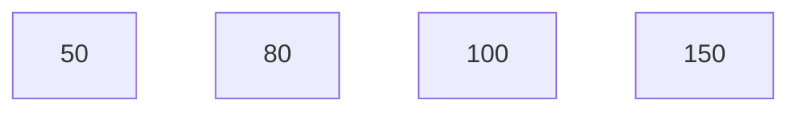
どこに追加すればいいのか、まずは探す必要があります。
これは二分探索を使いましょう。
80の次に追加するということが二分探索の結果判明しました。
じゃあ、そこに追加するだけだと思いますよね？

しかし、ここで落とし穴があります！
実は、80と100の間に90を追加するということは、90より右の値をすべてずらさなければいけないのです！
なぜなら、データは物理的に隣り合わせになっているのです！

プログラミングのリスト(["50", "80", "100", "150"])は物理的には隣り合わせではなく、あくまで人間からみると
隣り合わせで並んでいるだけですが、データベースは違います。
データベースにおける永続的な保存とは、物理的に保存するということです。
見かけ上ではなく、物理的に順序づけられて保存されている必要があるのです！(ディスクに保存するということです)
ちなみに、ディスクは永続的に保存することができるハードウェアです。データベースにうってつけですよね。
逆に、永続的ではなくて一時的な保存を担当するハードウェアをメモリといいます。

先ほどの例にもどると、90を追加すると、右側の100, 150を物理的に(ディスク上の位置を)ずらす必要があります。
現実世界でも、荷物をきれいに並べるために移動させることがありますよね？それと同じです。
じゃあ、150を右にずらし、100を右にずらし、空いたスペースに90を追加するという操作が必要ですよね。

効率的に探せても、効率的に追加することができていないですよね？
じゃあ構造を少し改良する必要があります。

### 矢印でつなげてみる
じゃあ、実際にどう改良するのか考えてみましょう。

先ほど、90を追加するときにデータをずらす必要があったのは、実際にデータを物理的に
隣り合わせに保存していたからです。

じゃあ、隣にあるということ(80の隣は100)を違った形で表現するのはどうでしょうか？

ここで、各データに「次はこれだよ」という矢印(ポインタ)を持たせてみましょう。

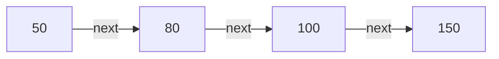

見た目は先ほどの図とそっくりですが、大きな違いがあります。さっきまでの図は
「50、80、100、150がこの順番で物理的に(ディスク上で連続して)並んでいる」
ことを表していました。しかし、今度は「50が物理的に(ディスク上の)どこにあってもいい。ただし
次は80だよ、という情報(矢印)だけを持っている」という意味になります。

これなら、90を追加するときにどうなるでしょうか？
80が100に向けていた矢印を90に向け直し、90に「次は100だよ」という矢印を持たせる
だけで済みますよね？

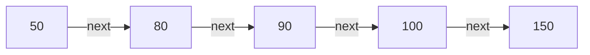

100や150は物理的にはディスク上のどこにあってもよく、一切動かす必要が
ありません！ずらす必要があったのは「物理的に並べていた」
からで、矢印で順序を表現すれば、追加は1回の操作(厳密には2回ですが)で済むわけです。

ただし、ここで新しい問題が出てきます！

### 矢印(ポインタ)方式の検索を考えてみる

矢印でつながったリストで、100を探すにはどうすればいいでしょうか？　

先ほどの二分探索は、「真ん中のデータに直接ジャンプできる」ことが前提でした。
しかし矢印でしかつながっていないデータは、真ん中のデータがどこにあるか、
先頭から矢印をたどっていかないと分かりません。物理的に探そうとしても、順序はありません。
なぜなら、先ほど「物理的にはディスク上のどこにあってもよく」と記述しました。
そのため、矢印をたどるしかないのです。

つまり、追加は速くなったものの、検索はまた振り出しに戻って、小さい値から(例で言えば、50から)しらみつぶし
になってしまったのです！

効率的に追加できて、かつ効率的に検索もできる。この両方を同時に満たすには、
どうすればいいのでしょうか？

ここで登場するのが、木構造です。

### 木構造で考えてみる

木構造は、矢印でデータをつなぐという考え方はそのままに、1つのデータから
複数の矢印を出すことを許します。

例えば、真ん中の値を100とすると、100より小さい50は左の矢印へ、100より
大きい150は右の矢印へ進みます。

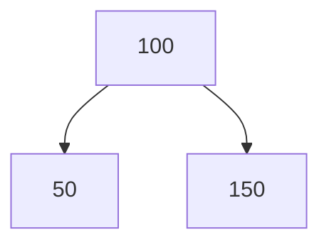

これ以降の木の図は、すべてこのルール(小さい方は左、大きい方は右)に
沿って描いています。

これなら、検索と追加の両方が速くなります。

実際に、50, 80, 100, 150を木構造にすると、こんな形になります。

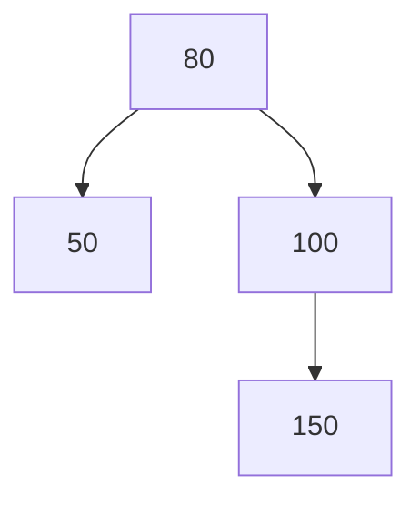

例えば100を探すとき、根(80)から出発して、探している値が100より小さければ
左、大きければ右、と枝を選んでいくだけで、しらみつぶしに探す必要は
ありません。根の80と100を比べて右へ進めば、もう100に着いています。
たった1回の分岐で見つかりましたね！先ほどのソート済み配列の二分探索と
同じように、一度に候補を半分に絞り込めるのです。

追加についても同様です。新しいデータを追加するときは、該当する枝の
先に新しい矢印をつなげるだけで済み、リストのときと同じく、既存の
データを物理的に動かす必要はありません。

例えば90を追加すると、こうなります。

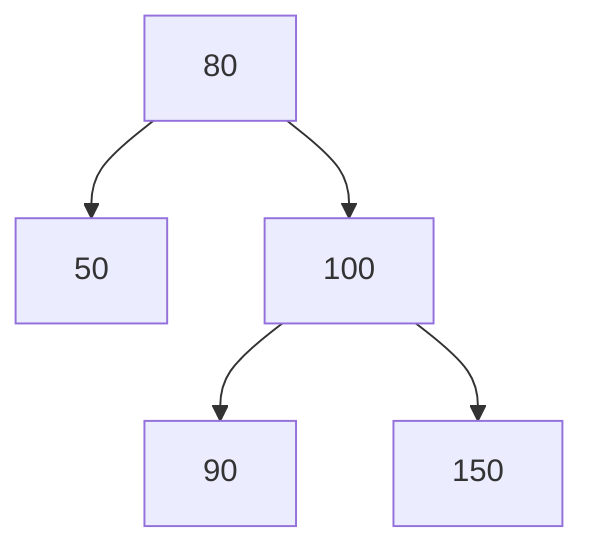

100の左に90がぶら下がっただけで、50や150は一切動いていません。

配列は検索が速いが追加が遅く、矢印だけのリストは追加が速いが検索が
遅い、というトレードオフがありました。木構造は、この両方のいいとこ
取りをした構造なんです！

しかしまだ弱点があるのです！

### 追加する順番によっては偏ってしまう

データの追加順序によっては、木が偏ってしまうということです。

例えば、50, 80, 90, 100, 150を、この順番のまま1つずつ追加していくと
どうなるでしょうか？

50を追加すると、これが根になります。
80を追加すると、50より大きいので右へ。
90を追加すると、50より大きいので右、80より大きいのでさらに右へ。
100を追加すると、同じように右、右、右へ。
150を追加すると、同じように右、右、右、右へ。

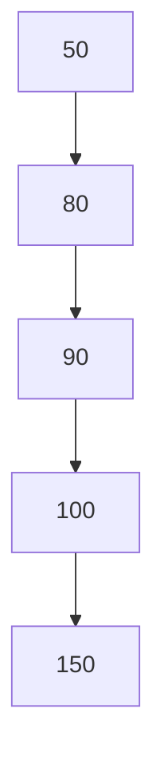

これでは、先ほどの「矢印だけのリスト」の図と全く同じ、ただの一直線に
なってしまいましたよね？

なぜこうなるかというと、追加するたびに必ず一番右側の枝に付け足す形に
なってしまい、真ん中で枝分かれするということが一度も起きていないから
です。

これでは、せっかく分岐できる木構造にしたのに、結局は根から順にたどる
しかない、しらみつぶしの探索に逆戻りしてしまいます。

だから、ただ木構造にすればいいわけではありません。枝分かれが偏らない
ように、常にバランスを保つことが重要なのです。これを解決するのが、B+Treeです！

## B+Treeはどうやってバランスを保っているのか

### 1つの箱に複数の値を持たせる

ここまで見てきた木は、1つの箱(ノード)に値を1つだけ持たせ、子も最大2つ
しか作れない「二分木」というものでした。

B+Treeはこれとは違います。1つの箱に複数の値を持たせることができ、子も
2つより多く持つことができます(多分岐)。

そして、1つの箱に入れられる値の数には上限があります。上限を超えて
追加しようとすると、箱を2つに分割し、真ん中の値を1つ上の階層に押し
上げます。この「分割」こそが、どんな順番でデータを追加してもバランス
が崩れない仕組みの正体です。

### 実際に試してみる

例えば、1つの箱に最大2つまで値を持てるとしましょう。先ほどと同じ、
50, 80, 90, 100, 150をこの順番のまま追加してみます。

50を追加します。

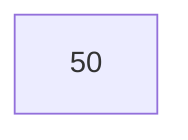

80を追加します。まだ上限(2つ)に収まっているので、そのまま同じ箱に
入ります。

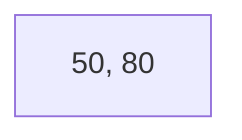

90を追加しようとすると、`50, 80, 90`で上限の2つを超えてしまいます。
ここで箱を2つに分割します。

でも、ただ2つに分けただけだと、後で検索するときに「50と90、どちらの
箱にどの値が入っているのか」が分からなくなってしまいますよね？

そこで、分割した2つの箱を仕分けるための目印として、真ん中の値(80)を
1つ上の階層に押し上げます。80より小さければ左の箱、80より大きければ
右の箱、という具合に、今までと同じ「小さい方は左、大きい方は右」の
ルールで振り分けられるようにするためです。

(今回は80より上の階層がまだ存在しない、一番最初の分割なので、押し
上げた80自身が新しい根になります。)

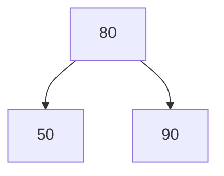

同じ追加順序でも、二分木だと80→90→100→150と一直線になってしまい
ましたが、B+Treeでは分割によって強制的に枝分かれしましたね！

100を追加してみましょう。90より大きいので、90が入っている箱に向かい
ます。`90, 100`でまだ上限内なので、そのまま入ります。

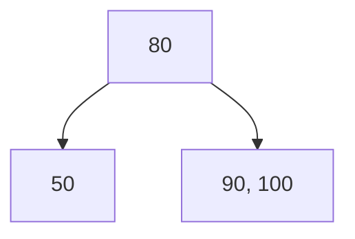

150を追加すると、`90, 100, 150`で上限を超えるので、また分割が起き
ます。ここでも同じ理由で、真ん中の100を仕分け役として1つ上の階層
(80がいる箱)に押し上げます。100より小さい90はそのまま左に残り、
100より大きい150は新しい箱に移ります。

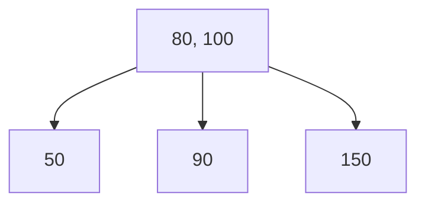

どんな順番で追加しても、上限を超えるたびに強制的に分割されるので、
木が一直線に伸び続けることがありません。まだB+Treeではありません！
もう少しでB+Treeになります！もう少しの辛抱を！

## なぜ二分木ではなく多分岐にしたのか

ここで疑問が浮かびませんか？

さっきの分割の仕組みだけなら、実は二分木のままでもバランスを保つことは
可能です。

なのに、なぜB+Treeは多分岐にしたのでしょうか？

その理由は、ディスクにあります。

### ディスクとメモリの速度差

以前、「ディスクは永続的に保存することができるハードウェア」で、
「メモリは一時的な保存を担当するハードウェア」だという話をしました。

実は、この2つには決定的な速度差があります。

木を検索するときにやっていることを、もう一度分解してみましょう。

1. 今いる箱をディスクから読み込んで、メモリに持ってくる
2. 箱の中に入っている値と、探している値を比較して、探している値でなければ、
   次にどの子(どの箱)へ進むか決める
3. 決まった子の箱について、また1に戻る

このうち、1の「ディスクから読み込む」という操作が、桁違いに時間が
かかります。一方、2の「メモリ上で値同士を比較する」という操作は、
すでにメモリに乗っているデータ同士の話なので、ほぼ一瞬で終わります。

つまり、本当に遅いのは「値同士を比較する回数」ではなく、「箱をディスク
から読み込む回数」そのものなんです。

だったら、1つの箱に入れられる値の数を増やしてしまえばいいですよね？

### 二分木の高さがlog2(n)になる理由

ここで、なぜ二分木の高さがlog2(n)になるのか、確認しておきましょう。

二分木の箱(ノード)は、最大2つの子しか持てません。ということは、

- 一番上の根は1個
- その下の階層は、根の子なので最大2個
- さらにその下は、その2個それぞれが2つずつ子を持つので、最大4個
- さらにその下は、最大8個

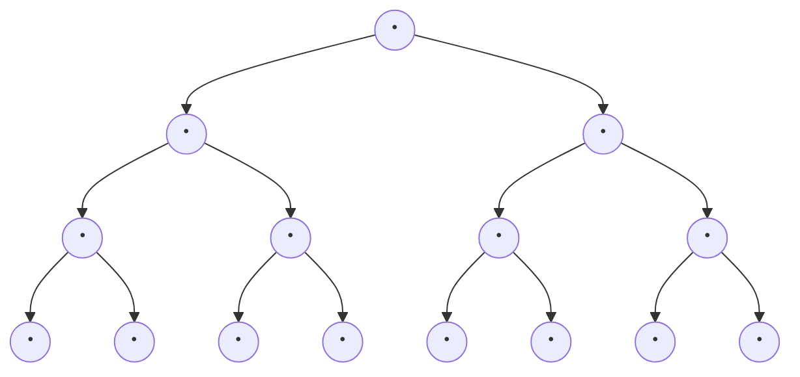

上から1段ずつ、1個→2個→4個→8個と、階層が下がるごとに箱の数が
ちょうど2倍になっているのが分かりますね。

というように、1階層下がるごとに、置ける箱の最大数が2倍に増えていきます。

全部の階層を合計すると、高さhの木には最大で1+2+4+...+2^h、つまり
2^(h+1)-1個のデータを詰め込めることになります。ただ、この式のままだと
少し扱いにくいので、桁数だけざっくり把握したい今回は、一番下の階層の
個数である2^h個で近似してしまいましょう。一番下の階層だけで、全体の
およそ半分を占めているので、桁数を見る分にはこの近似でも問題ありません。

つまり、n個のデータを格納したいなら、2^h ≒ n となるような高さhが
あれば十分、ということになります。例えば8個のデータを格納したいなら
2^3 = 8なので、二分木の高さhは log2(8) = 3 のように、log2(n) = h と
導出できます。

実際に数字で確認してみましょう。

| 高さh | 詰め込める最大件数(2^高さh) |
| --- | --- |
| 1 | 2 |
| 2 | 4 |
| 3 | 8 |
| 10 | 1,024 |
| 20 | 約104万 |
| 27 | 約1億3400万 |

### 多分岐にすると高さが下がる

高さがたった27の木でも、1億件を超えるデータを詰め込めてしまうんです。
だから逆に言えば、1億件のデータを二分木に詰め込むには、高さ27もあれば
足りる、ということになります。

これはまさに、先ほど二分探索で計算した「log2(1億) ≒ 27回」と同じ
数字ですよね？1回の比較で候補を半分に絞れる二分探索と、1階層下がる
たびに置ける個数が倍になる二分木は、実は表裏一体の関係なんです。

つまり、二分木のまま1億件のデータを扱うと、木の高さは約27になる、
ということです。木の高さ = 根から目的のデータまでたどる箱の数なので、
検索のたびに、最悪27回もディスクにアクセスしなければいけません。

しかし、1つの箱に100個の値を持たせられるとしたらどうでしょうか？

log100(1億) ≒ 4

なんと、木の高さは約4で済んでしまいます！同じ1億件のデータでも、
ディスクアクセスの回数を27回から4回まで減らせるのです。

これが、B+Treeが1つの箱に複数の値を持たせる、多分岐の木にしている
理由です。

## B+Treeの「+」の意味

実は、さっき50, 80, 90, 100, 150を使って組み立てた木は、まだ本当の
B+Treeではありません。

### 葉だけにデータを持たせる

さっきの木を思い出してみましょう。


根の箱には、80と100という値がそのまま入っていますよね？分割のときに
「真ん中の値を上に押し上げる」と説明しました。なぜなら「値はすべて特定の階層に
入っている」というような制限は何もなかったからです。だから、値が一番上にあろうが、
一番下にあろうが、関係なかったのです。

これは、B-Treeと呼ばれる、B+Treeの元になった構造の性質です。
B+Treeは、ここが少し違います。

B+Treeでは、実際のデータは、必ず一番下の階層(葉)に置き
ます。上の階層(内部ノード)は、実データを持たず、「どっちに進めば
いいか」を示すためだけのキーを持つだけです。

同じ50, 80, 90, 100, 150を、今度はB+Treeのルールで組み立て直すと、
こうなります。

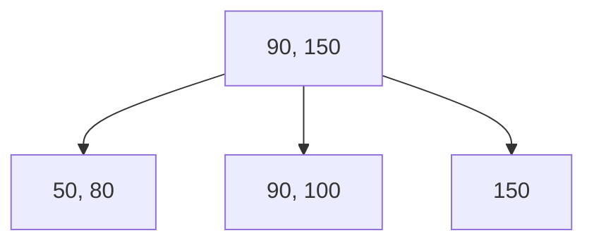

根にある90と150は、あくまで「90より小さい値は一番左へ、90以上150未満
は真ん中へ、150以上は一番右へ」という道しるべ用のコピーです。90と150の
本物のデータは、それぞれ葉にちゃんと入っています。

なぜこうするのかを、もう少し詳しく見てみましょう。

前提として、1つの箱(ページ)の大きさは決まっています。

ここで、実際の行のデータ(例えば、名前や住所など、たくさんの列を
持つ1行分の実データ)と、キー(比較にしか使わない、1つの値)を
比べてみましょう。実データは列の数だけ場所を取るので大きく、キーは
値1つ分なのでずっと小さいですよね。

内部ノードが実データを持たず、キーだけを持つようにすると、限られたサイズの
箱の中に、実データを持つ場合よりもずっとたくさんのキー(つまり、
道しるべ)を詰め込めます。ということは？
キーが多い分、分岐がいっぱいできます！

これは、直前で説明した「多分岐にしてディスクアクセスの回数を減らす」
という目的と、そのまま繋がっています。もし内部ノードにも実データを
持たせてしまうと、その分1箱に入るキーの数が減ってしまい、分岐の数が減り、
木の高さも下がりにくい(段数が多いまま)という結果になります。
なので、B+Treeでは葉(一番最下層)のみ実データを持つ設計になっています！

### 具体的なテーブルで確認してみる

ここまで50, 80, 90, 100, 150という数字だけで説明してきましたが、
実際のデータベースだとどうなるのか、簡単なテーブルで確認してみましょう。

例えば、こんなusersテーブルがあるとします。

| id | name |
| --- | --- |
| 50 | Alice |
| 80 | Bob |
| 90 | Carol |
| 100 | Dave |
| 150 | Eve |

idを主キー(PRIMARY KEY)とすると、このidの値をキーにして、さっきと
同じB+Treeが組まれます。

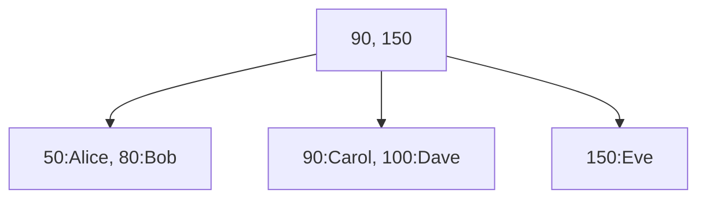

葉(一番下)には、id・nameどちらの列も含んだ行がまるごと入っています。
しかし根にある90と150は、道しるべ専用のコピーなので、nameの情報は
一切持っていません。

例えば `SELECT * FROM users WHERE id = 100` を実行すると、まず根の
90と150を100と比較して、90以上150未満なので真ん中の葉へ進み、その
葉の中で100を見つけて、そこに入っている `id=100, name="Dave"` という
行をまるごと返す、という流れになります。

### 葉同士をつなげる

全部のデータが葉に集まった、というのが分かったところで、もう1つだけ
仕掛けがあります。葉同士を、横方向にも矢印でつないでおくのです。

```mermaid
graph TD
    R["90, 150"] --> L1["50, 80"]
    R --> L2["90, 100"]
    R --> L3["150"]
```

「50, 80」「90, 100」「150」という3つの葉を、横方向にもつなげます。

```mermaid
graph LR
    L1["50, 80"] -.next.-> L2["90, 100"] -.next.-> L3["150"]
```

これが何の役に立つのでしょうか？

例えば、「80以上100以下のデータを全部探す」というような、範囲を
指定した検索(SQLで言うBETWEENやWHERE id > 80のようなクエリ)を考えて
みましょう。

葉同士がつながっていなければ、80を見つけたあと、90を探すために
また根から木をたどり直し、100を探すためにまた根からたどり直し、
と毎回木を上り下りする必要があります。

しかし、葉同士が横につながっていれば、根から木をたどるのは最初の
1回だけで済みます。まず根から辿って80が入っている葉「50, 80」を
見つけ、あとはnextの矢印を使って、「50, 80」→「90, 100」→「150」
と横に進んでいくだけで、範囲内のデータを全部拾えるのです。

木を上り下りする回数を減らせる、というのは、まさにここまで見てきた
「ディスクアクセスの回数を減らす」という話そのものですよね。範囲検索
のような、たくさんのデータをまとめて読み出す処理と、B+Treeはとても
相性がいいんです。

## まとめ
お疲れ様です！

ここまでの話を整理すると、こんな流れでした。

- 何も考えずに並べる → 追加は楽だが、検索はしらみつぶし
- 昇順に並べる → 検索は二分探索で速くなるが、追加のたびにデータをずらす必要がある
- 矢印(ポインタ)でつなぐ → 追加は速くなるが、検索がまた線形に逆戻り
- 木構造にする → 検索・追加どちらも速くなるが、追加順序によっては偏ってしまう
- B+Tree → 箱を分割してバランスを保ち、多分岐にしてディスクアクセスを減らし、葉だけにデータを持たせて範囲検索も速くする

配列・リスト・二分木、それぞれの弱点を1つずつ潰していった先にB+Treeが
ある、というのが伝わっていれば嬉しいです！

気軽にコメントください！
